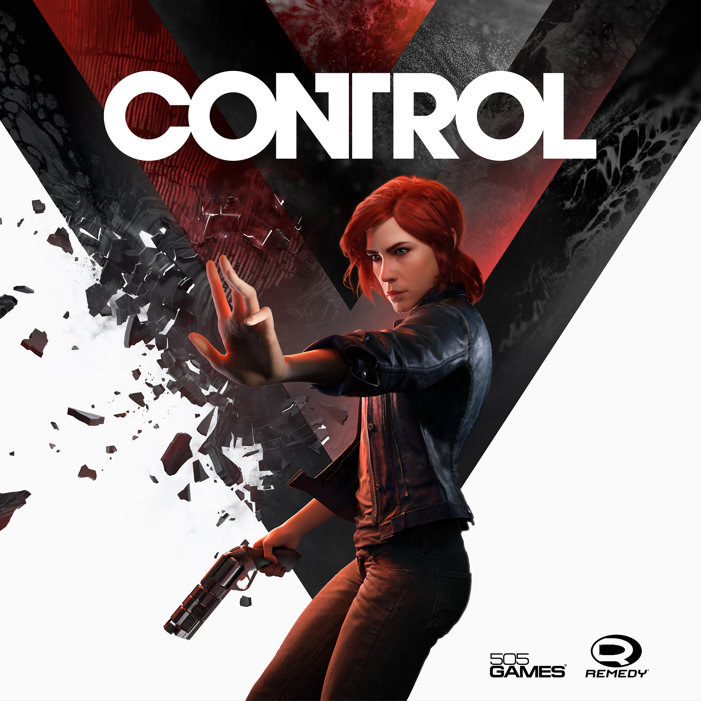
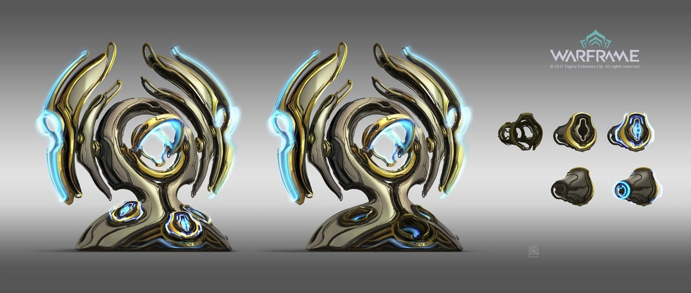
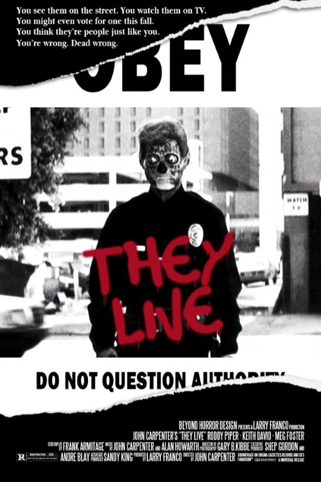

# Computional Arts U10E2

- [Introduction](#introduction)
- [Object-oriented ontology & Speculative realism](#object-oriented-ontology--speculative-realism)
- [Kantian philosophy](#kantian-philosophy)
- [Video games](#video-games)
    - [Control](#control-2019)
    - [Warframe](#warframe-ongoing)
- [They Live](#they-live)
- [21st Mythology BBC Sound (2014)](#21st-mythology-bbc-sound-(2014))

## Introduction
In this project, I aim to advance my artistic practice by drawing deeply from the rich terrain of philosophical theory while also using media to help understand the premise of each ideology, specifically integrating elements from two seemingly contrasting perspectives: Object-Oriented Ontology/Speculative Realism and Kantian philosophy. Despite their often opposing stances, one focused on de-centring the human perspective and the other emphasising the limitations of human perception, I seek to explore how these frameworks might coexist and inform one another within my art. By weaving together these philosophical viewpoints, I aim to demonstrate that both perspectives can offer valuable insights, depending on the chosen frame of reference. This approach reflects philosophical inquiry’s complex and nuanced nature, revealing how diverse theoretical perspectives can enhance and enrich our understanding of reality through artistic expression.

## Object-oriented ontology & Speculative realism
Object-oriented ontology (OOO), developed by thinkers like Graham Harman, posits that all objects, whether living beings, inanimate objects, or even abstract concepts, have an existence and agency independent of human perception. It argues against Anthropocentrism, the belief that human experience is the central or most important perspective. Instead, OOO suggests that objects interact with each other in ways that are not always accessible or understandable to humans, emphasising the equality and autonomy of all entities in the universe.

Speculative realism is a broader philosophical movement that emerged in the early 21st century as a reaction against the dominant trend of post-Kantian philosophy, which posits that we can only know the world as it appears to us, not as it is in itself. Speculative Realists challenge this by asserting that the world exists independently of human thought and can be understood without privileging human perception. They explore the idea that reality is not limited to human experience and that we can speculate about the nature of reality beyond the limits of our understanding.

Both movements share a common goal: to decenter the human subject and explore the nature of reality from a non-anthropocentric perspective.

## Kantian philosophy

Kantian philosophy, rooted in the work of Immanuel Kant, centres on the idea that human experience is shaped by how our mind structures perceptions. Kant proposed a distinction between the noumenal world (things in themselves, which exist independently of our perception) and the phenomenal world (things as they appear to us, filtered through our senses and cognitive frameworks). He argued that while we can never have direct knowledge of the noumenal world, we can understand the phenomenal world through categories such as time, space, and causality, which are innate to the human mind. Kant also emphasised the importance of morality and autonomy, proposing that moral actions are determined by universal principles known as the categorical imperative, which dictates that one should act according to maxims that could be universally applied. This approach to ethics strongly emphasises duty, rationality, and the inherent worth of individuals.

## Video games

Exploring OOO and Speculative Realism through the lens of video games provides a unique and compelling perspective on the autonomy and agency of digital objects within virtual environments. Video games create intricate worlds populated by myriad objects, each endowed with properties, behaviours, and interactions independent of player intervention. By analysing these digital realms through OOO and Speculative Realism principles, we can appreciate how in-game objects, ranging from mundane items to complex characters and landscapes, exist and interact in ways that transcend their practical functions for the player.

OOO, focusing on the independence and interconnectedness of all objects, encourages us to see video games not merely as entertainment but as rich ontological spaces where objects possess a degree of agency and presence. This approach aligns with Speculative Realism’s challenge to the anthropocentric limitations imposed by traditional philosophy, particularly in rethinking the centrality of the human subject in understanding the world. Within the context of video games, this shift in perspective allows for a more holistic and immersive experience, where the autonomy of objects contributes to the depth and realism of virtual worlds.

Furthermore, applying Kantian philosophy to video games opens another layer of analysis. Kant’s distinction between the noumenal (things-in-themselves) and the phenomenal (things-as-they-appear) realms can be mirrored in the dual existence of video game objects: as coded entities with inherent properties (noumenal) and as elements experienced by players (phenomenal). This Kantian lens helps to deepen our understanding of how video game objects straddle these two realms, existing with an intrinsic reality beyond their utility to the player.

Video games’ dynamic and interactive nature makes them ideal for exploring how objects interact independently of human control, providing tangible examples of OOO, Speculative Realism, and Kantian concepts. By engaging deeply with the ontological fabric of video game worlds, my project has gained valuable insights into the autonomy and agency of objects, ultimately enhancing my understanding and application of these philosophical frameworks in broader contexts. Thus, these perspectives collectively offer a robust framework for understanding and appreciating the intricate and often overlooked object relations that contribute to the depth and realism of video game worlds.

In the ever-evolving landscape of philosophical inquiry, the intersection of OOO, Speculative Realism, and Kantian philosophy offers a profound lens through which to explore the complex realities of digital environments. Video games, as immersive and interactive experiences, serve as fertile ground for examining these philosophical frameworks in action. By delving into the agency and autonomy of in-game objects, we can uncover how these virtual entities operate beyond mere player utility, revealing deeper ontological truths about their existence. This exploration enriches our understanding of video games as ontological spaces. It challenges traditional narratives and hierarchies within game design, ultimately inviting a more nuanced appreciation of the digital worlds we inhabit. Inspired by these concepts, I have drawn upon this philosophical discourse in creating my piece, using video games as a catalyst to explore the intricate relationships between objects and their autonomy within a broader ontological context.

### Control (2019)

In the video game “Control,” OOO offers a framework for understanding the complex interplay of objects and environments that define the player’s experience. “Control” immerses players in a world where non-linear time flow and a need to retrace steps become essential aspects of gameplay, emphasising the autonomy and agency of objects within the game. The narrative structure, which eschews a straightforward progression, allows objects and spaces to reveal their significance and histories in a fluid, dynamic manner. This approach aligns with OOO’s principle that objects exist independently of human perception, each possessing its temporal narrative that players must uncover through exploration and interaction.

Speculative realism further deepens this analysis by challenging the anthropocentric view that has traditionally dominated philosophy. In “Control,” the game’s world operates according to its own rules, independent of the player’s presence or actions. This underscores Speculative Realism’s assertion that objects and environments have realities beyond human understanding or control. This perspective invites players to engage with the game’s world as a self-contained reality, where the agency of objects is not merely a reflection of player interaction but an inherent quality of the game’s ontological structure.

One of the most striking manifestations of these concepts in “Control” is the Service Weapon, a gun that changes its form physically to meet different needs. This transformative ability underscores the object’s agency and versatility, emphasising that it is not merely a tool for the player but an autonomous entity with its intrinsic properties and capacities. The Service Weapon’s various forms—ranging from a pistol to a shotgun and beyond—highlight the object’s role within the game’s ontology, where it acts and reacts within the world of “Control” independently of the player’s immediate desires. From a Kantian perspective, this can be seen as an exploration of the distinction between the noumenal (the weapon as it truly is, with all its potentialities) and the phenomenal (the weapon as the player in its various forms experiences it).

The developers of “Control” also ingeniously utilised the game’s physical space to enhance exploration through telekinesis. The Bureau of Control, with its shifting architecture and hidden passages, serves as an active participant in the narrative, challenging players to interact with it in innovative ways. Through telekinesis, players can manipulate the environment, moving objects to solve puzzles or uncover secrets, thus engaging with the world as a dynamic, responsive entity. This interaction exemplifies OOO’s view that objects are not passive backdrops but active contributors to the narrative and gameplay experience. From a Kantian perspective, the Bureau’s architecture can be seen as representing the complex relationship between the noumenal world (the building’s true form) and the phenomenal experience of navigating it, which is constantly reshaped by the player’s actions.

In “Control,” the seamless integration of non-linear time, the transformative Service Weapon, and the interactive environment through telekinesis demonstrates how OOO, Speculative Realism, and Kantian philosophy can be applied to video game design. It highlights the autonomy and agency of objects within the game world, creating a rich, immersive experience that encourages players to engage deeply with the ontological fabric of the virtual environment. Through these philosophical lenses, “Control” becomes more than a game; it is a living, breathing world where objects and spaces possess their own stories and significance, independent of human intervention. This multi-layered analysis reveals “Control” as a profound exploration of the complex relationships between objects, environments, and players, offering a compelling example of how video games can serve as a medium for philosophical inquiry.

### Warframe (ongoing)

In the video game “Warframe,” OOO allows us to analyse how Orkin artefacts and culture serve as vessels for preserving memories from the past. Within the game’s expansive universe, the Orkin civilisation is long gone, yet their artefacts and cultural remnants persist, exerting a profound influence on the present. OOO emphasises the autonomy and agency of objects, suggesting that these Orkin relics exist and act independently of the human (or player) perspective, embodying their histories and significance. This perspective has mainly influenced my work, highlighting how such concepts can be reproduced and appreciated even with today’s technology.

 The Orkin artefacts in “Warframe” are not mere background elements but active participants in the game’s narrative and gameplay. These objects, from architectural structures to personal relics, carry the weight of Orkin culture and history. By exploring and interacting with these artefacts, players uncover layers of the Orkin legacy, learning about their technological advancements, societal structures, and ultimate downfall. This process aligns with OOO’s assertion that objects are repositories of their narratives, revealing their past through the interactions they foster in the present.

Speculative realism further enriches this analysis by challenging the traditional anthropocentric view of the world. In “Warframe,” the Orkin artefacts exist with their inherent value and significance, independent of the player’s or any human perspective. This aligns with Speculative Realism’s argument that objects have their realities that are not merely a reflection of human perception or interaction. In this sense, the Orkin relics serve as reminders of a civilisation that once was, maintaining their presence and influence in the game’s universe even as they remain primarily inscrutable and mysterious to the player.

Additionally, Kantian philosophy offers another layer of understanding. Kant’s distinction between the noumenal (the objects as they truly are) and the phenomenal (the objects appearing to the player) is reflected in how these Orkin artefacts are perceived within the game. The artefacts have an existence that transcends their immediate appearance, embodying the essence of the Orkin civilisation. Players engage with the phenomenal aspect of these objects through gameplay. In contrast, the noumenal aspect—the full depth of their history and significance—remains partially hidden, only revealed through deeper exploration and interaction.

## They live

The movie They Live (1988) profoundly influenced the incorporation of polarising glasses into my work. In this cult classic film directed by John Carpenter, the protagonist discovers a pair of sunglasses that reveal hidden messages and subliminal commands embedded in advertisements and media, exposing a hidden reality controlled by alien forces. The use of polarising glasses to unveil obscured truths resonates deeply with the themes of perception and hidden realities, mirroring the principles of Object-oriented Ontology (OOO) that I employ in my work. 
The glasses in They Live are a tool for the protagonist to perceive a reality beneath the surface of everyday life, challenging the notion that objects and appearances are straightforward and transparent. This aligns with OOO’s assertion that objects have their autonomous existence and significance, independent of human perception. By revealing the hidden agendas behind seemingly innocuous advertisements, the glasses empower the protagonist to question the status quo and resist manipulation. Similarly, in my work informed by OOO, polarising glasses symbolise a commitment to interrogating conventional understandings of objects and their relationships, uncovering hidden truths, and challenging established hierarchies.

Speculative realism also enriches this perspective by pushing beyond the anthropocentric limitations of traditional philosophy. In They Live, the protagonist’s discovery of an alien-controlled reality hidden in plain sight reflects Speculative Realism’s idea that the world holds mysteries and structures beyond human comprehension. The polarising glasses thus become a metaphor for accessing these more profound layers of reality, which exist independently of human awareness but can dramatically alter our understanding of the world when revealed.

From a Kantian perspective, the glasses can be seen as a means of navigating between the phenomenal world (the reality as it appears to the unassuming public) and the noumenal world (the actual, hidden reality controlled by the aliens). Kantian philosophy suggests that while we can only perceive the world through our senses, there exists a more profound truth that we cannot fully access. The polarising glasses in They Live offer a rare glimpse into this noumenal world, allowing the protagonist—and, by extension, the viewer—to perceive the underlying forces shaping their experience.

They Live has been a powerful inspiration for integrating polarising glasses into my artistic and philosophical endeavours, enriching my exploration of OOO, Speculative Realism, and Kantian philosophy. These glasses symbolise a broader quest to uncover hidden layers of reality, challenge surface-level interpretations, and engage more profoundly and critically with the world. Through this lens, my work reveals the complex and often obscured relationships between objects, perceptions, and the hidden structures that govern our understanding of reality.

## 21st Mythology BBC Sound (2014)
“21st Century Mythologies” from BBC Radio 4 delves into examining contemporary myths and cultural phenomena through the lens of Roland Barthes’ work. Barthes, in his essays collected in “Mythologies,” scrutinises seemingly ordinary objects and cultural practices, revealing the deeper meanings and ideologies they embody.

The transition from traditional cork stoppers to screw caps on wine bottles serves as a focal point for understanding broader societal shifts. This change reflects a practical alteration in packaging and symbolises more significant transformations in consumer culture, authenticity, and tradition. Barthes’ analysis highlights how mundane objects can become imbued with symbolic significance, shaping cultural narratives and practices.

Moreover, Barthes’ critique of consumer culture and mass media underscores the pervasive influence of advertising and propaganda in shaping collective beliefs and desires. The rise of digital media amplifies these dynamics, as advertising copywriters and image makers wield significant influence over public perceptions and behaviours.

By scrutinising contemporary myths and cultural practices, “21st Century Mythologies” prompts listeners to examine modern society’s narratives and ideologies critically. Through this exploration, it becomes evident how myths shape our understanding of the world, influencing everything from consumer choices to political beliefs. 

Overall, “21st Century Mythologies” has played a pivotal role in broadening my understanding of how objects function as carriers of meaning and ideology within society. The series has deepened my appreciation for the intricate web of relationships that define the ontological landscape, illuminating the implications of object-oriented thinking in diverse realms of human experience.
